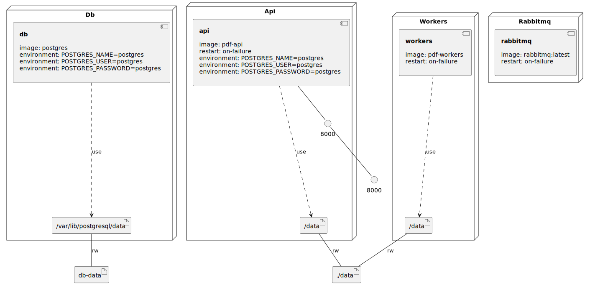

## Introduction

Simple scalable pdf to png API built with django, dramatiq, rabbitmq, postgresql and docker.


## Requirements

Docker and Docker Compose.


## Setup

Build the service using docker-compose:

```console
docker-compose build
```

Run the service:

```console
docker-compose up
```

To teardown:

```console
docker-compose down
```

## Usage

Upload a pdf file and get a returning json with document id `{"id": 1}`. Some example files are provided in `pdf_rendering_service/api/tests/test_data`, max file size 10 Mb:

```console
curl -X POST -F file=@/path/to/file.pdf http://localhost:8000/api/documents
curl -X POST -F file=@./pdf_rendering_service/api/tests/test_data/simple_file.pdf http://localhost:8000/api/documents
```

Use the document id to get the status of the processing and number of pages, returning json `{"status":"processing","n_pages":0}`, `{"status":"done","n_pages":1}`:

```console
curl http://localhost:8000/api/documents/1
```

Download the png image of one page of the pdf with the following get request (in 1200x1600 format, landscape pdf will be 1600x1200) .

```console
curl -O -J http://localhost:8000/api/documents/1/pages/1
```

Note : pdf and png files are saved locally in the `data` folder.

## Testing

### docker

Some testing can be run by first getting the container id of the running pdf-api image:

```console
docker container ls
```

And then execute django testing:

```console
docker exec <container-id> ./manage.py test api.tests.tests
```

### local

Local running and testing can also be done, provided dependencies are met and test_settings.py is updated accordingly (database credentials)

```console
python manage.py runserver --settings=api.tests.test_settings
python manage.py rundramatiq --settings=api.tests.test_settings
python manage.py test api.tests.tests --settings=api.tests.test_settings
```


### Infrastructure model

- [api component model](.infragenie/api_component_model.svg)

---
